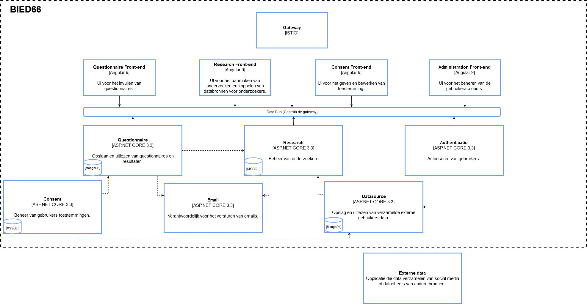

# Architecture

The project contains the following services all connected to an ISTIO gateway:

- Questionnaire back-end
  - Save and read questionnaire results
- Questionnaire front-end
  - Where you can fill in questionnaires
- Email back-end
  - To send emails
- Research back-end
  - Standard CRUD operations for research
- Research front-end
  - To add, delete, edit, research and couple datasources to researches
- Consent back-end
  - Where the consent of users is kept
- Consent front-end
  - Where an user can login and give consent on datasources per research
- Authentication back-end
  - Standard authorization
- Authentication front-end
  - Where the user can log-in
- Datasource back-end
  - The storage place for external data

## Url routes
To see how to contact every service you can find the main route maps in the [environment](../../environments/values-TEMPLATE.yaml) folder.
For back-end specific routes you can check the [proto buffers](../../libraries/protobuffers/protobuffers/protobuffers/protobuffers) folder.

