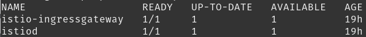

# Handleiding

Dit hoofdstuk geeft toelichting over het gebruik van Istio en hoe daarmee bepaalde services openbaar kunnen worden gemaakt. Deze handleiding gaat in op slechts de basis. Voor extra informatie of een edge-case neem contact met mij (Tim van Osch) op.

## Quickstart

Dit is een “Get-Up-and-Running” hoofdstuk en gaat niet in op Istio of de werking. Dit hoofdstuk zorgt ervoor dat je Istio geïnstalleerd en werkend heb.

**Vereisten**:

- Repository gecloned
- Kubernetes draaiend via
  - Minikube
  - Docker-Desktop
- Kubectl geinstalleerd
- Helm of Kip geinstalleerd

**Stappen**:

1.  Istio configuratie en operator deployen via helm of kip.  
    Indien kip niet werkt, zie [kip/issues/6](https://github.com/debugged-software/kip/issues/6)

    - `$ helm install istio deployments/gateway`
    - `$ kip deploy -c gateway`

2.  Activeer SideCar injection in de juiste namespace (bijv. default)  
    `$ kubectl label ns default istio-injection=enabled`

3.  Wacht totdat de deployments in istio-system beschikbaar zijn (READY 1/1).  
    `$ kubectl get deploy -n istio-system`



## Testen

In deze test zal een “echo-server” worden gedeployed op het pad /echo.

1.  Deploy echo-server in cluster:  
    `$ kubectl apply -f docs/gateway/demo/echo-deployment.yaml`

2.  Expose echo-server via Istio:  
    `$ kubectl apply -f docs/gateway/demo/echo-istio.yaml`

3.  Test deployment via browser. (Zie “IP Adres” hoofdstuk)  
    `http://<IP_adres>/echo`

### IP Adres voor Minikube

**Optie 1**
De LoadBalancer een IP toewijzen via een Tunnel.

1.  Start een tunnel zodat LoadBalancer services een IP adres krijgen. Dit vereist sudo of administrator rechten.  
    `$ minikube tunnel`

2.  Zoek `ExternalIP` voor `istio-ingressgateway`. Dit is het IP adres voor de Istio Ingress Gateway. Hier worden services blootgesteld.  
    

**Optie 2**
Een andere optie is om de NodePorts aan te spreken van de IngressGateway.

1.  Zoek de nodeport voor port 80 op van de IngressGateway:  
    `kubectl get svc -n istio-system istio-ingressgateway`

2.  Zoek het ip van minikube  
    `$ minikube ip`

3.  Combineer IP en port:  
    bijvoorbeeld: `192.168.39.233:31982`  
    

### IP Adres voor Docker-Desktop

1.  WSL2: Configureer WSL met LocalhostForwarding:
    Open of creeer bestand: %UserProfile%\.wslconfig
2.  Schrijf `localhostForwarding=true` onder `[wsl2]`
    ```
    [wsl2]
    localhostForwarding=true
    ```
    _Tip: Zet hier ook limieten op geheugen verbruik_
    ```
    [wsl2]
    memory=4GB
    swap=0
    localhostForwarding=true
    ```
3.  Het IP Adres is nu 127.0.0.1 (of localhost). Dit is het IP adres voor de Istio Ingress Gateway. Hier worden services blootgesteld.
