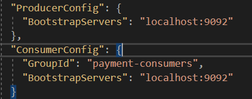
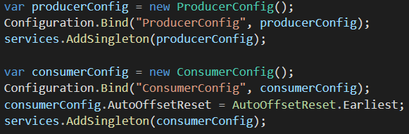
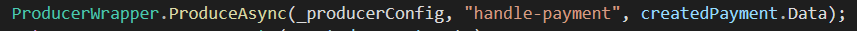
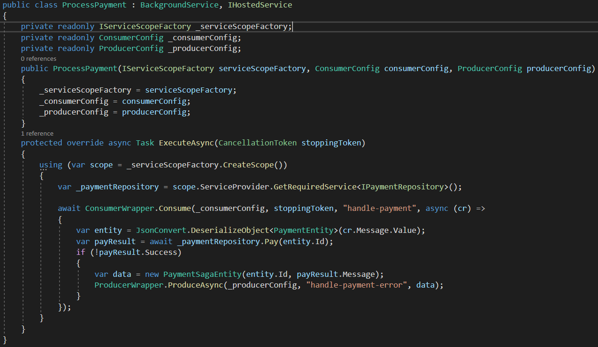
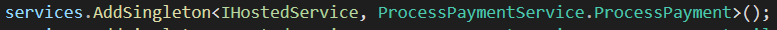

# Kafka Demo Documentation
A full demo project with Kafka implementation can be found here: https://github.com/spoilerdo/KafkaDemoProject

## Implement Kafka into a .Net Core 3.3 project
First step is to download Confluent.Kafka and add Consumer and Producer configurations in the appsettings.json:

In the startup file you can add these configuration to a singleton Consumer and Producer Config class:

The localhost:9092 needs to be the Kafka access point within your cluster. For local development you can use localhost if you use the instructions in the following demo project: https://github.com/spoilerdo/KafkaDemoProject 

Within that demo project you can also find Producer- and Consumer wrappers that help to make the code cleaner. You can find them in the following folder: paymentApp/Common.

Now make a producer call to a certain topic using the producerWrapper:

For the consumer you need a BackgroundService to make it run in the background on a separate thread. This will make it continuously searching for new data on a certain topic:

You also need to make the class a singleton in the startup file:

For more information about the implementation visit the demo project: https://github.com/spoilerdo/KafkaDemoProject 

## Useful links
- Transactions (useful for consuming in a microservice): https://www.confluent.io/blog/transactions-apache-kafka/ 
- Full Kafka with rollback explanation: https://medium.com/@sharmaNK/asynchronous-payment-7de952460845
- Kafka documentation: https://kafka.apache.org/documentation/ 