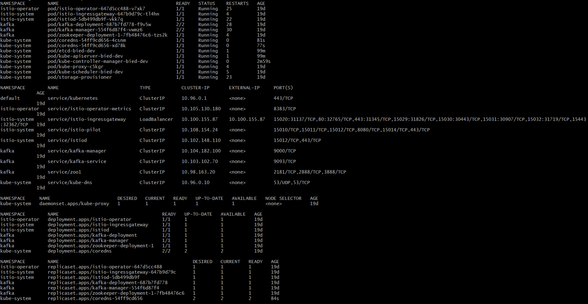

# Local development
This readme will provide you with documentation about the local development of this project. It also contains some specific information to develop with certain technologies like Kafka.

## General information
This chapter gives some general information on how to run this project locally.
We tested it to run it on Minikube or docker desktop.

### Start a local cluster:
#### Use Minikube
If you want to run it on Minikube you need to **add an .env file** to the root of this project with the following content: `RUNNER=minikube`.

0. Begin with configuring the correct drivers: https://minikube.sigs.k8s.io/docs/drivers/
1. Install Kip: https://github.com/debugged-software/kip/releases  
2. Run kip check to see if you installed all the dependencies  
3. Start your local cluster: `minikube start -p bied-dev --cpus 4 --memory 6144 --kubernetes-version=1.13.11`
4. Stop the cluster`minikube -p bied-dev stop`
5. Run kip to initiate the project: `kip run start-minikube`
6. Use Kip to deploy charts or services to the cluster (more information can be found on the official [github](https://github.com/debugged-software/kip/releases) page).

#### Use Docker Dekstop
0. Install docker desktop: https://www.docker.com/products/docker-desktop
1. Install Kip: https://github.com/debugged-software/kip/releases  
2. run `kip check` to see if you installed all the dependencies  
3. In the setting activate Kubernetes and wait until it is started.
4. Run `kip build`
5. check if there are any crashes: `kubectl get all --all-namespaces`
6. Use Kip to deploy charts or services to the cluster (more information can be found on the official [github](https://github.com/debugged-software/kip/releases) page).

#### Deploy something with Helm:
If you have successfully started a local cluster you can use helm instead of kip to deploy something:  
`helm install <NAME> <Path to HELM Chart>`  
or  
`helm upgrade --install <NAME> <Path to HELM Chart>`

Make it available for local development:  
`minikube tunnel -p bied-dev` (to tunnel istio gateway)  
or  
`kubectl -n <NAMESPACE> port-forward <DEPLOYMENT> <PORT:PORT>` (to port-forward a deployment)

# Run Kafka locally
If you want to run Kafka locally you will need to change some values to the yaml files.
But you can also copy the yaml configuration files in the deployment folder of the following kafka demo project:
https://github.com/spoilerdo/KafkaDemoProject 

In order to run kafka local follow these steps:
1. First you have to start a kubernetes cluster.
2. Go to the root of this project with your CLI.
3. Use `helm install gateway deployments/gateway` to install the istio gateway.
4. Use: `helm install kafka deployments/kafka` to install kafka.
5. Use: `helm install kafka-manager deployments/kafka-manager` to install the kafka-manager.
   This is a UI manager were you get an overview of topics, brokers and more.
6. To see if all the pods have been deployed correctly run the following command: `kubectl get all --all-namespaces`.
   The result should look like the following picture:
   
7. If you use minikube you will need to open a tunnel in order to access the kafka-manager: `minikube tunnel`.
8. To go to the kafka-manager you can type in the external IP of the istio gateway service into a browser and login with the following credentials:  
   username: admin  
   password: admin  
9. Now to start local development you will need to port forward the kafka input port otherwise you cant access kafka: `kubectl -n kafka port-forward <DEPLOYMENT NAME> 9092:9092`.
10. Now run the project locally (don't recommend using IIS Express) and you can make GRPC calls to the backend trough: localhost:5000.