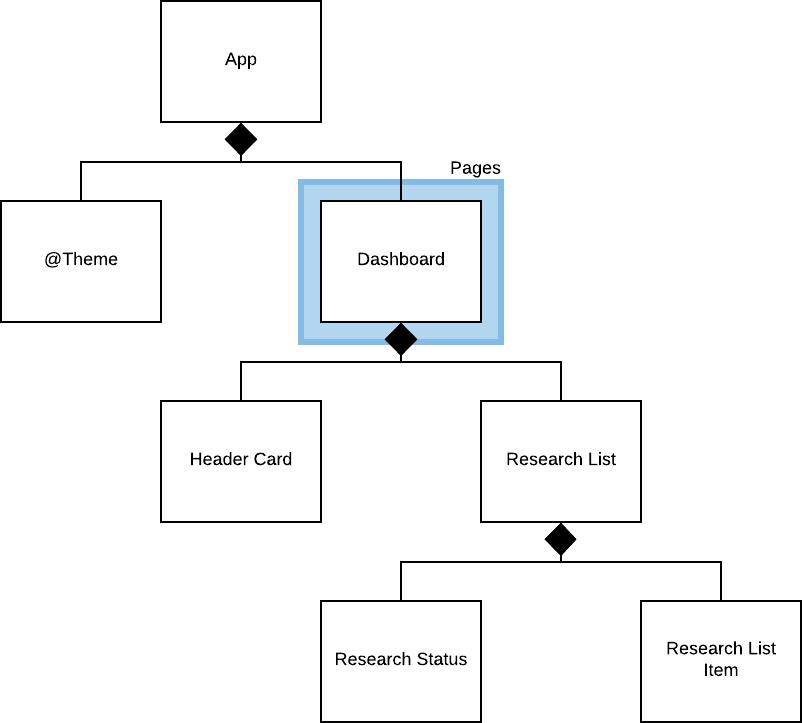
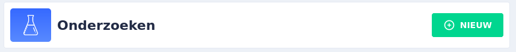

## Componenten

Dit document bevat de component die gebruikt worden in de research-ui.

1. [@Theme](#@Theme)
2. [Dashboard Page](#Dashboard_Page)
3. [Header Card](#Header_Card)
4. [Research List](#Research_List)



### @Theme

Deze module is een wrapper voor de Nebular Theme. Hierin zijn twee stylesheets opgegeven: `themes.scss` en `styles.scss`, waarbij de eerste gebruikt kan worden om van themas te switchen en/of zelf een thema toe te voegen. En de `styles.css` is voor het daadwerkelijke stylen van componenten. Hierin worden in ieder geval de styles van Nebular geimporteerd en "geinstalleerd".

Indien je een component toevoegd dat gebruik maakt van een Nebular styling, dan kan je verwijzen naar deze stylesheet. Als standaard worden alle stylesheets gewrapped in de `nb-install-component` mixin.

```scss
@include nb-install-component() {
  ...
  .icon {
    border-radius: nb-theme(card-border-radius);
    display: flex;
    align-items: center;
    justify-content: center;
  }
  ...
}
```

### Dashboard Page

De dashboard pagina is de root pagina en bevat een overzicht met onderzoeken voor de onderzoeker.

### Header Card

De header card is in feite een icon + title + actions card, waarmee de pagina geintroduceerd kan worden:



De header card heeft twee eigenschappen: de icon en de titel. De contents van de header card element worden rechts uitgelijnd en bevat in de meestal gevallen interacties voor de gebruiker.

```html
<ngx-header-card title="Onderzoeken" icon="assets/research-icon.svg">
  <button nbButton status="success">
    <nb-icon icon="plus-circle-outline"></nb-icon> Nieuw
  </button>
</ngx-header-card>
```

### Research List

Research-list visualiseerd onderzoeken in een lijst-vorm en berekend daarbij de tijdsstatus van een onderzoek (bijv. "start over...", "eindigt binnen ...", etc) Dit component heeft een eigenschap `researches` die vereist een array van `Research` modellen. Dit model is te vinden onder `src/app/dashboard/models/research.ts`
